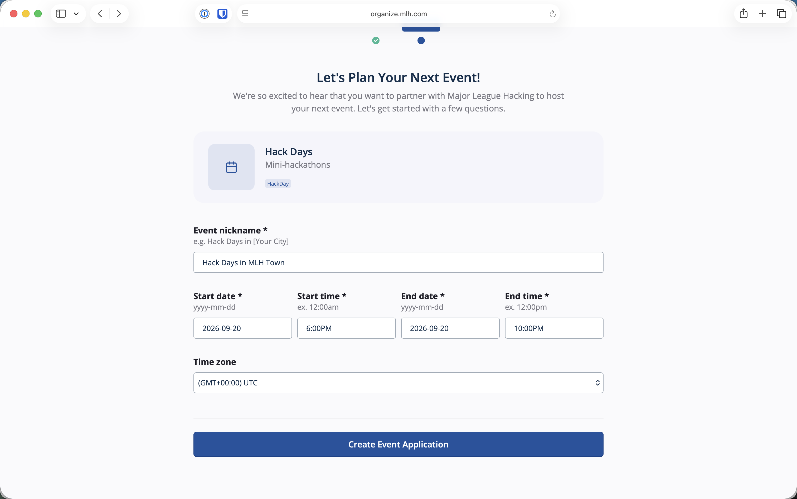
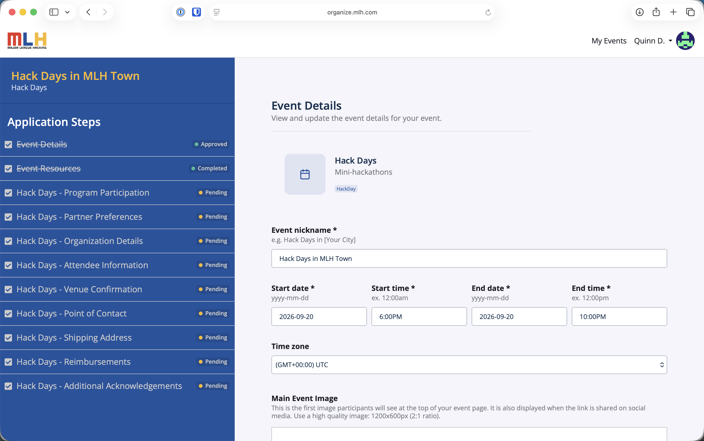
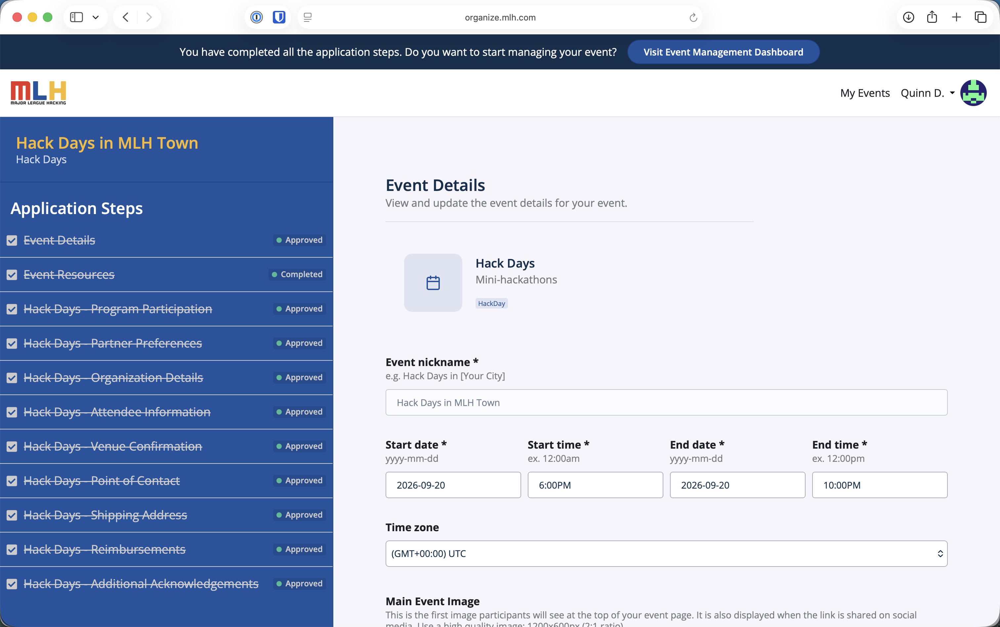

# Apply to Host

*Last reviewed: August 2026.*

Apply while your event is still at the idea stage. Submit your application at least one month before the proposed event date so MLH has time to review it and prepare any event materials.


**Start your application:** [Apply to host a Hack Day](https://organize.mlh.com/host/hack-days).


## Start the Application

1. Sign in at the application link above.
2. Confirm that **Hack Days — Mini-hackathons** is the selected event type, then select **Continue**.
3. Enter an event nickname, start and end date, start and end time, and time zone.
4. Select **Create Event Application**.

<figure><figcaption>
Enter the basic event details to create the application.
</figcaption></figure>

## Complete Every Application Step

The application workspace separates the information MLH needs into a set of steps. Complete each one, even if some details may change later:

* Event Details
* Program Participation and Partner Preferences
* Organization Details and Point of Contact
* Attendee Information and Venue Confirmation
* Shipping Address and Reimbursements
* Additional Acknowledgements

Review [Requirements and Eligibility](requirements-and-eligibility.md) while completing the form. Be ready to provide a complete in-person venue or realistic venue plan, your expected attendance and audience, your organizing organization or community, and why the event is a good fit for Hack Days. A preferred partner is a request, not a guarantee.

<figure><figcaption>
Complete each Hack Days application step and check that it shows as submitted.
</figcaption></figure>

## After You Apply

The Hack Days team will review the application. Individual steps may remain **Pending** while that review is in progress. If approved, the application will show the steps as **Approved** and offer a **Visit Event Management Dashboard** button.

<figure><figcaption>
Once approved, move into the event management dashboard to prepare the public event page.
</figcaption></figure>

Your approval or onboarding information will confirm:

* The approved event format and audience
* Your assigned MLH partner categories
* Available reimbursement support
* Whether MLH expects to send physical materials
* Whether winners should expect physical prizes or digital gift cards
* The opening ceremony materials for your event


Wait for approval before advertising MLH affiliation, an assigned partner category, or a prize. MLH adds assigned partner challenges, which will appear automatically on the event's **Challenges** page.


Continue to [OrganizerHQ](organizerhq-tutorial.md) to check the event page and open registration.

## Planning While You Wait

You may reserve a venue, recruit an organizing team, and draft a schedule while your application is under review. For general advice about teams, sponsorship, marketing, venues, and large-event logistics, use the [MLH Hackathon Organizer Guide](https://guide.mlh.com/). Return to this guide for Hack Day-specific requirements and OrganizerHQ workflows.
