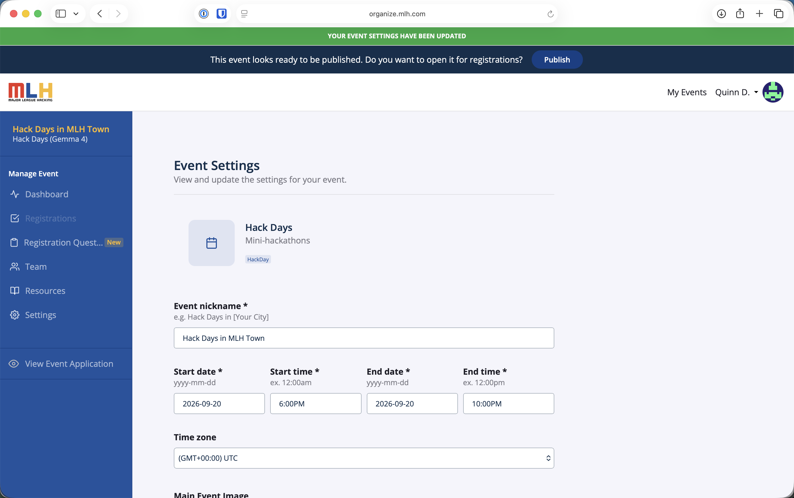
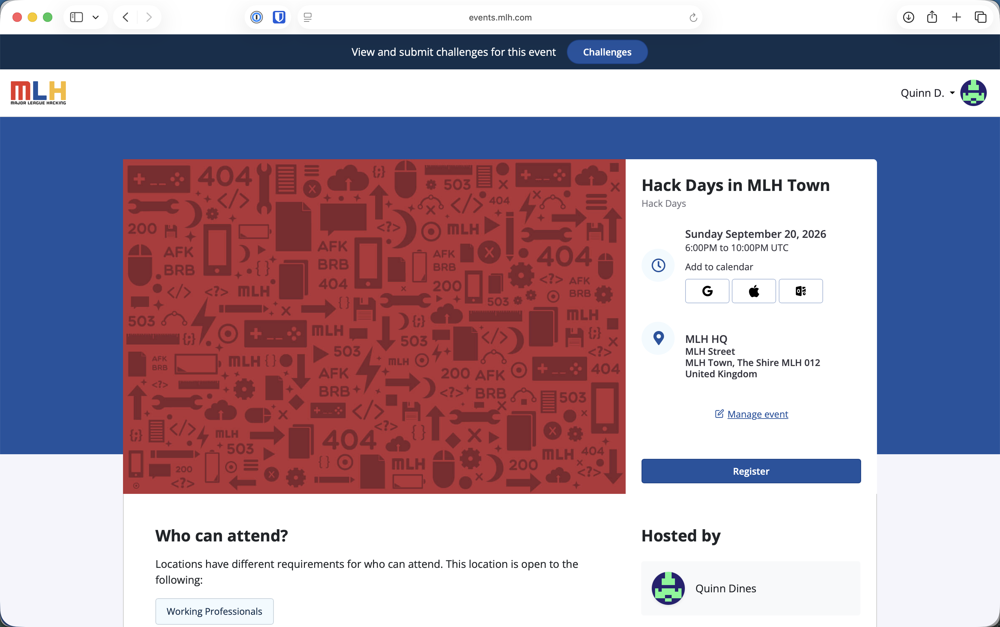

# OrganizerHQ

*Last reviewed: August 2026.*

OrganizerHQ is the required system of record for every Hack Day. Use the event portal for attendee registrations, day-of check-ins, project submissions, challenge selections, and MLH partner winners.

## Move Into Event Management

After MLH approves the application, select **Visit Event Management Dashboard**. The event management area includes **Dashboard**, **Registrations**, **Registration Questions**, **Team**, **Resources**, and **Settings**.

Before opening registration:

1. Open **Settings**.
2. Confirm the event name, date, start and end times, time zone, venue, audience, and contact information.
3. Add a clear event image and description.
4. Make it unmistakable that the event is free and entirely in person.
5. Include food, accessibility, and arrival information.
6. Save the event settings.

## Publish the Registration Page

When the event is ready, use the **Publish** button in the “open it for registrations” banner. Publishing makes the public event page available and opens registration.

<figure><figcaption>
Select Publish after checking the event settings.
</figcaption></figure>

Open **View Event Page** and check the page in a signed-out browser window. Confirm that the **Register** button works and that the date, time zone, address, audience, host, and event image are correct before sharing the link.

<figure><figcaption>
The published event page is the registration link to share with attendees.
</figcaption></figure>

If a public detail is wrong, return to **Settings**, correct it, and save the event before promoting the page.

## Register Attendees

Share the public event page rather than the organizer management URL. Attendees select **Register** and complete registration with their MLH account. Ask them to use the same account when they later submit a project.

Track registration totals from **Registrations** in the event management dashboard. MLH sends the standard registration confirmation and reminder emails; use [Attendee Communications](event-planning-guide/attendee-communications.md) for the local details that still need to be shared.

## Check In Attendees

1. Open the event before doors open.
2. Confirm that the check-in view is available to the people staffing the entrance.
3. Check in each attendee while they are physically present at the venue.
4. Resolve duplicate or missing registrations while the attendee is present.
5. Compare the checked-in count with the number of people in the room before the opening ceremony ends.


Reimbursement is based on verified OrganizerHQ check-ins, not registration totals or a separate attendance sheet.


## Confirm the Event Challenges

MLH assigns partner challenges to approved events. Organizers do not create or add these challenges themselves; each assigned challenge automatically appears on the event's **Challenges** page and project submission form.

Compare the Challenges page with your approval or onboarding materials. If an assigned challenge is missing or incorrect, take a screenshot and email [hackdays@mlh.io](mailto:hackdays@mlh.io) with the event name and affected category.

### Add an Optional Local Challenge

You may add a locally created category in addition to the partner challenge assigned by MLH:

1. Open the public event page while signed in as an organizer.
2. Select **Edit Event**.
3. In **Challenges**, select **+ Add Challenge**.
4. Complete the challenge details, then select **Publish**.
5. Return to the public Challenges page and confirm that the local category appears alongside the assigned MLH challenge.

<figure><figcaption>
Use Add Challenge only for an optional locally created category; MLH partner challenges are assigned automatically.
</figcaption></figure>


Keep a local challenge clearly separate from the MLH partner challenge, which is assigned automatically. Any prize for a local category is organizer-provided unless your approval says otherwise.


## Manage Projects and Winners

Use **Manage Submissions** from the public event page to set the submission window, review projects, assign winners, and control when the public project gallery appears.

Follow [Project Submissions and Judging](project-submissions.md) for the current submission and review flow. Follow [Closing Ceremony and Winner Declaration](event-planning-guide/closing-ceremony-and-winner-declaration.md) to mark every partner winner and publish the gallery.

## Troubleshooting

If an attendee, assigned challenge, project, or winner does not appear as expected:

1. Confirm that you are viewing the correct event.
2. Refresh the page and remove any active challenge or winner filters.
3. Confirm that the attendee is signed in to the account they used to register.
4. Take a screenshot of the unexpected state without exposing unnecessary personal information.
5. Email [hackdays@mlh.io](mailto:hackdays@mlh.io) with the event name, affected workflow, and screenshot.
