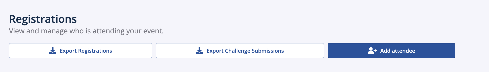

# Project Submissions at Hack Days

We're rolling out a new integrated tool to make it easy and simple for your hackers to submit their hacks to your Hack Day. On your event's OrganizerHQ (OHQ) page, hackers will see a button to submit to an MLH Challenge.&#x20;

<figure><figcaption></figcaption></figure>

Hackers will then be able to submit their projects. They will need to fill mandatory fields, such as GitHub repo, Technologies Used, and Project Name and Description.

All submitted projects can be viewed by the organizer through OHQ by clicking on "Registrations --> Export Challenge Submissions"

<figure><figcaption></figcaption></figure>

This will email a .csv list of the projects to the event organizer.
