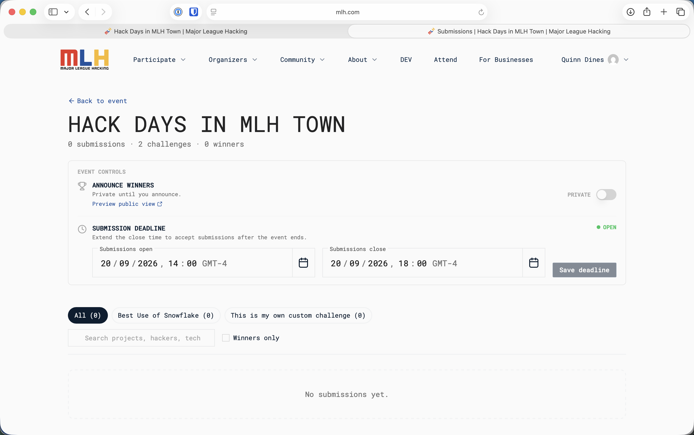
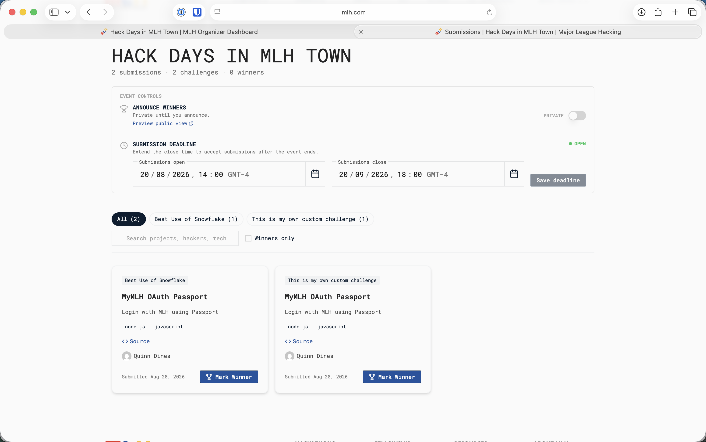

# Project Submissions and Judging

*Last reviewed: August 2026.*

Every presenting project must be submitted through the event's **Challenges** page. Teams must also select each eligible partner challenge they are entering. Devpost, a form, or another platform does not replace this flow.

## Set the Submission Window

An organizer controls when teams can submit:

1. Open the public event page while signed in as an organizer.
2. Select **Manage Submissions**.
3. Under **Submission Deadline**, set the **Submissions open** and **Submissions close** date and time.
4. Select **Save deadline**.
5. Check the status at the right of the section. It shows **OPEN** while submissions are available.

Open submissions during build time and close them at the project deadline, before demos begin. If the deadline changes, update it here and communicate the same change to every team.

<figure><figcaption>
Set and save the submission window from Manage Submissions.
</figcaption></figure>

## Before Building Begins

Tell hackers:

* The exact submission deadline
* Which partner and local challenges are available
* The required project information
* The demo format and time limit
* The judging criteria
* That every presenting project must be submitted, even if it is not entering a partner challenge

Open the **Challenges** page yourself and confirm that every challenge assigned by MLH appears correctly. The **Add Submission** button becomes available only during the saved submission window.

## How Teams Submit Projects

One team member should submit the project on behalf of the team:

1. Sign in using the account used to register for the event.
2. Select **Challenges** in the “View and submit challenges for this event” banner.
3. Select **Add Submission**.
4. Enter the project link, project name, description, and technologies used.
5. Add a demo URL if the team has one.
6. Under **Which challenge(s) are you submitting to?**, select every partner and local challenge the project is eligible to enter.
7. Select **Submit Project** before the deadline.

<figure><figcaption>
Teams start from the event's Challenges page while submissions are open.
</figcaption></figure>

<figure><figcaption>
Complete the required project fields and select every eligible challenge before submitting.
</figcaption></figure>


The same project can appear once for every challenge it selected, and the total shown in Manage Submissions may count those challenge entries. This is expected; do not treat them as duplicate project forms.


## Verify Every Project Before Demos

Return to **Manage Submissions** before demos begin:

1. Identify each unique project in the **All** view and compare it with the teams scheduled to present. Do not rely on the headline total when projects entered more than one challenge.
2. Use the challenge tabs to confirm that each assigned partner category has the expected entries.
3. Search by project, hacker, or technology when you need to find a specific submission.
4. Ask a missing team to submit while the window remains open. Apply the same deadline policy to every team.
5. Confirm that the submission window is closed when demos begin, then refresh the list.

<figure><figcaption>
Review unique projects and use each challenge filter to confirm coverage before judging.
</figcaption></figure>

## Use a Simple Judging Rubric

Score every eligible project using the same criteria. A lightweight rubric works well for short events:

| Criterion | What judges should consider |
| --- | --- |
| Technical implementation | Does the project work, and how effectively does it use the chosen technology? |
| Creativity | Is the idea or implementation distinctive? |
| Learning and ambition | What did the team learn or attempt during the Hack Day? |
| Demo and clarity | Can the team clearly explain the problem, solution, and implementation? |
| Partner eligibility | Does the project satisfy the assigned partner's specific requirements? |

Tell judges how to handle ties before judging starts. A judge should disclose a close relationship with a team and recuse themselves when that relationship could affect the result.

## Select Proposed Winners

For each MLH partner category:

1. Filter Manage Submissions to the relevant challenge.
2. Confirm that the project appears under that challenge.
3. Verify the partner-specific evidence described on the relevant partner page.
4. Select the strongest eligible project using the published rubric.
5. Record the proposed result in the judges' notes.

Do not announce a winner yet. Continue to [Closing Ceremony and Winner Declaration](event-planning-guide/closing-ceremony-and-winner-declaration.md) to mark each winner, verify the saved result, and make the project gallery public.
